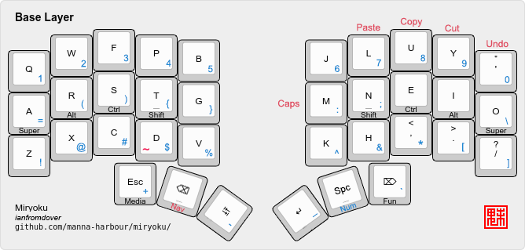

# Running Miryoku
1. Simply navigate to this folder
2. use the `kmonad.exe` to run any .kbd file
3. for `mii.kbd`, quit by selecting this terminal again, do NAV-q, and type Ctrl-c again to cancel the kmonad process

# Layers and maps
## Izumi
### All

*Work in progress*

Other Layers

*Work in progress*

### From Miryoku

All

Base

Nav

Media

Func

# How to build Miryoku
- Get Miryoku from [its original repo](https://github.com/kmonad/kmonad), and get KMonad from [its original repo](https://github.com/kmonad/kmonad)

# Windows
- installing Miryoku on Windows 10
## Install KMonad
1. Follow the [guide on the KMonad](https://github.com/kmonad/kmonad/blob/master/doc/installation.md#windows-environment) repo to install kmonad on windows.
2. Extra steps: get scoop, `scoop install msys2`, `scoop install stack`, `scoop install haskell`
3. `stack` might timeout when installing, just wait half an hour and try again.
4. The new kmonad.exe will be in `.\.stack-work\install\xxxSomeHashxxx\bin\`

## Get the Miryoku keymap
1. Fork the [original Miryoku KMonad implementation](https://github.com/manna-harbour/miryoku_kmonad) repo to generate the keymap using Github Actions online
2. Look at the readme to determine what alphas (base layer), nav layer, clipboard, OS ... to get, and be ready to copy the options over
3. While doing step 2, open the github actions in another window
4. Select the Build Inputs action, and Click Run workflow > paste your desired options into the blanks.
5. Click the workflow after it is done and download the build artifact (your .zip file with a very long name)
6. clone miryoku to your machine and then under `src/build` paste your unzipped files
7. from the `src/build` directory, run KMonad with your .kbd file. by doing `../path/kmonad.exe miryoku_something.kbd` and it should work until you encounter an error, which is how you exit.
8. (highly recommended) create a script that does step 7 so that you can easily start miryoku next time. The script can be found in this repo.

