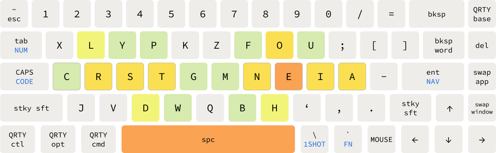
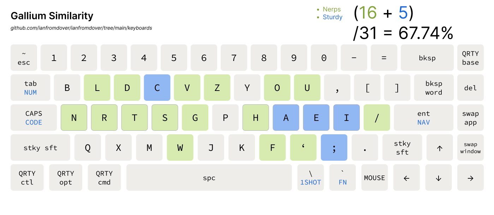
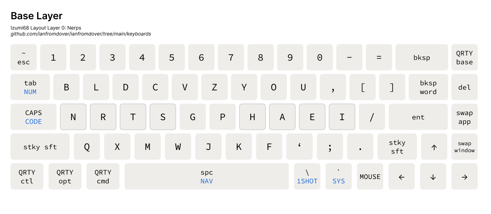
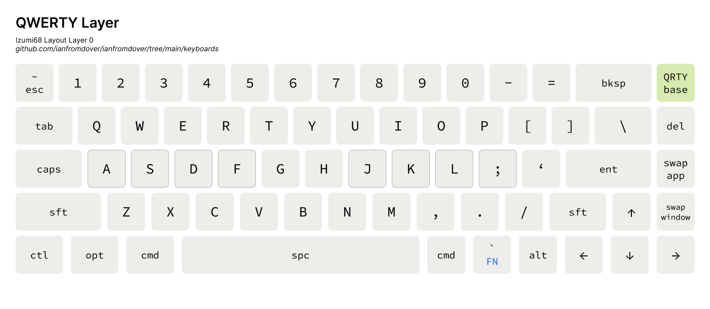
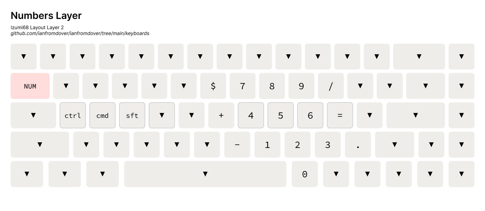
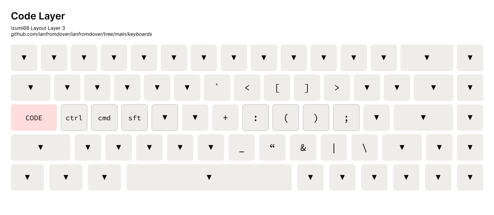
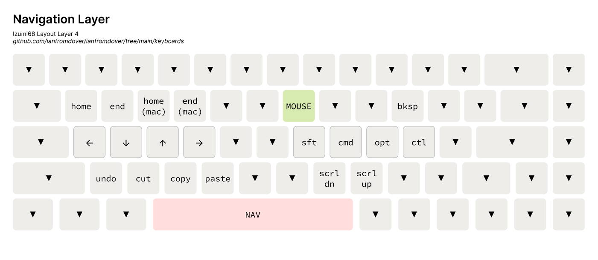
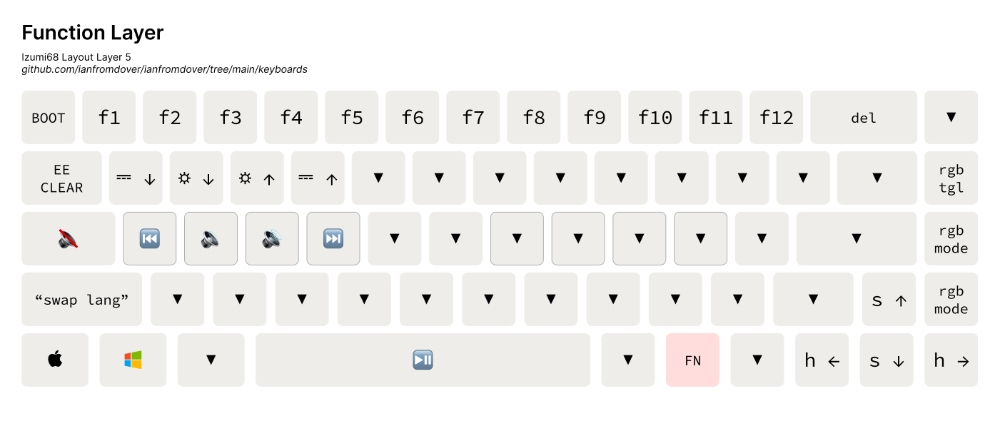
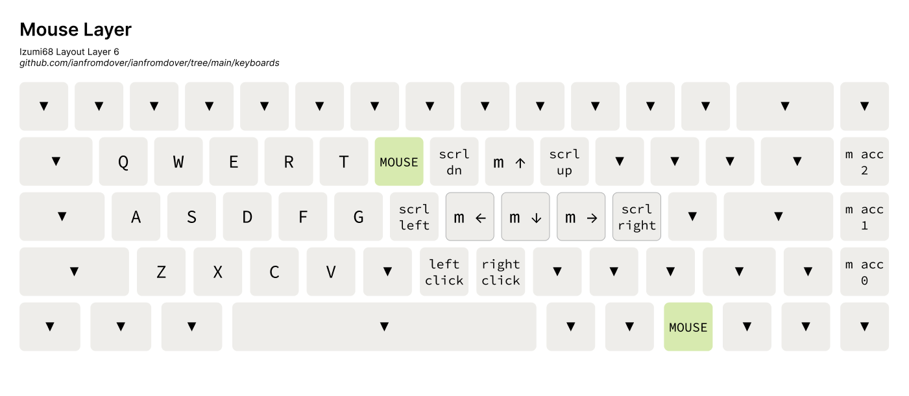

# The Izumi Layout

This layout first originated from `Miryoku` for a corne keyboard (with `Colemak-DH`),
incorporated ideas from `Callum`, and then it moved to a 68-key tofu65, using `Gallium` for the alphas. I still keep a version for the corne.

The latest iteration is v6.1, `-t` for tofu, `-c` for corne

This diagram shows how frequently each letter is pressed on `Gallium`:



Design considerations:

- use sticky keys instead of holding shift
- have macros for my most frequently used keys
- if a thumb key is held down, the corresponding hand's home row becomes modifiers that can be held down as well when appropriate
- qwerty layer for shortcuts(eg. cmd-Q), mouse control, gaming and `Unity` viewport control
- navigation layer includes arrow keys, the `home`, `end`, keys that you can pair with shift and meta key
- favourite feature: control music volume and playback directly from the home row

Here is how similar `Gallium` is with other popular layouts that I had learnt previously:



## For Tofu Keyboard

### Alphas



### QWERTY



### Numbers



### Code



### Navigation



### Function Layer



### Mouse



Can also be used to play "FPS games" like Minecraft.

### One-Shot


## Corne

- Difficulty of reaching determined by this chart from the colemak github:


### Alphas


### Alphas


### Navigation


### Numbers


### Code


### FPS

Also considered a 'mouse' layer, this layer is for playing Minecraft one-handed, or navigating in Unity using WASD.


### System


### One-Shot

Tapping any button in this layer brings you out of the layer. Meant for quick one-time-use functions. Launching the apps are achieved using macros.

<!-- TODO: Update image -->


# Flashing this Layout to a Corne

Follow the instructions on the [official corne page](https://github.com/foostan/crkbd/blob/main/doc/firmware_en.md)
but use the .hex file in this repo to flash through QMK Toolbox instead.

# Running this Layout Using KMonad

Note: the latest layout version on KMonad is v4.6

## Windows
1. Simply navigate to this folder
2. use the `kmonad.exe` to run any .kbd file
3. for `win-izumi.kbd`, quit by selecting this terminal again, do NAV-q, and type Ctrl-c again to cancel the kmonad process

## MacOS
1. Follow the kmonad installation instructions below to install kmonad 
2. use the ./kmonad in the installation path to run the `mac-izumi.kbd` file
3. quit by selecting this terminal again and type `NAV-q` to cancel the kmonad process.  

4. (highly recommended) Create an alias `iz` to start this process easily from the terminal.

# Install KMonad on Mac
1. Follow the [guide on the KMonad](https://github.com/kmonad/kmonad/blob/master/doc/installation.md#installing-the-dext) repo to install kmonad on MacOS. I installed the `dext` because the kext had problems.
2. `brew install stack` 
3. `stack` might timeout when installing, just wait half an hour and try again.
4. The new kmonad executable is in `/Users/USERNAME/Documents/PATH-THAT-YOU-CLONED-KMONAD/kmonad/.stack-work/install/x86_64-osx/SOME-HASH/8.10.7/bin/kmonad`

Additionally, some people on the Canary discord have inspired me to make this a 'programmer' layout. Hence, when you hold down `⌘`, the keymap reverts to QWERTY so that you can use shortcuts normally.

## Running this layout Using Karabiner

First, install [Homebrew](https://brew.sh) with

```bash
/bin/bash -c "$(curl -fsSL https://raw.githubusercontent.com/Homebrew/install/HEAD/install.sh)"
```

Afterwards, simply install [Karabiner](https://github.com/pqrs-org/Karabiner-Elements) with

```bash
brew install --cask karabiner-elements
```

Finally, place `karabiner.json` from this repo into `~/.config/karabiner`

<!-- to add how to set up Goku here -->

