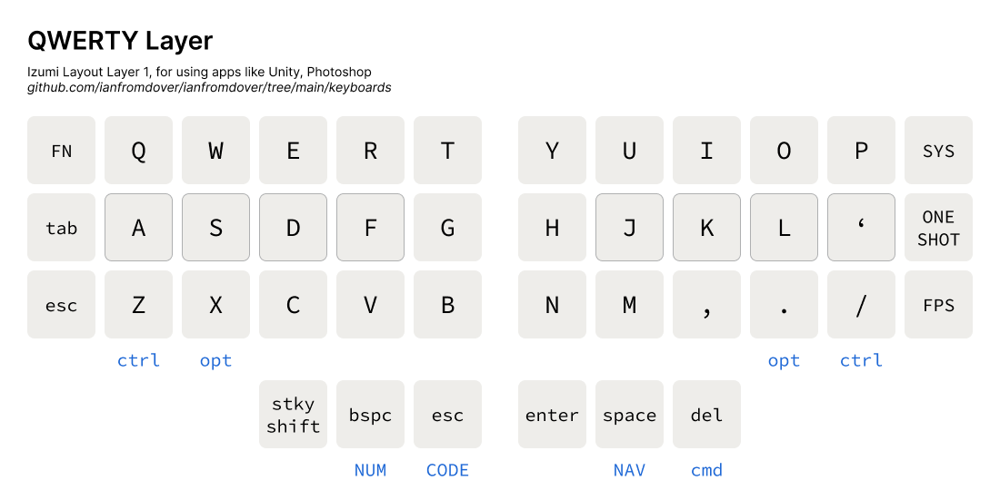
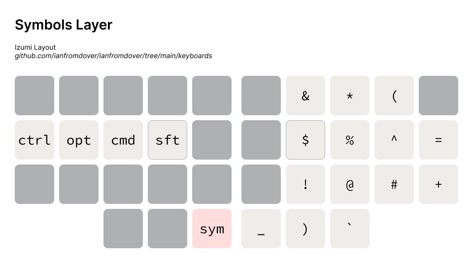
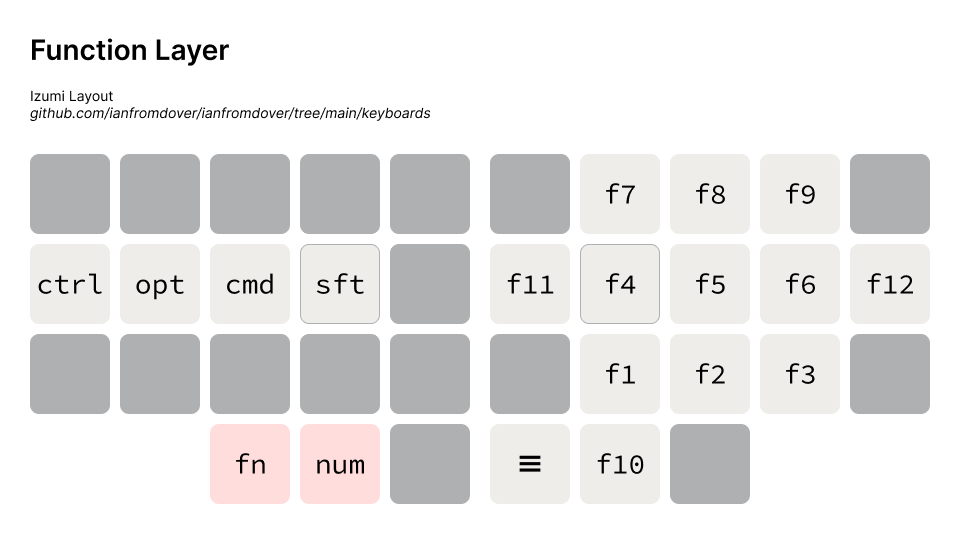

# The Izumi Layout

*Izumi is a 36-key layout.* Features: 
- uses colemak DH matrix and the Miryoku layout as a base
- navigation layer has arrow keys, `home`, `end`, `copy`, `paste`, and many useful shortcuts
- favourite feature: control music volume and playback directly from the home row
*Work in progress*

### Base(Alphas) - Colemak DH Matrix

### Qwerty

This layer is for Unity's WASD for navigation. 

### Numbers

### Symbols

### Code

### Function

### Navigation

### System

# Running the Izumi Layout

## Windows
1. Simply navigate to this folder
2. use the `kmonad.exe` to run any .kbd file
3. for `win-izumi.kbd`, quit by selecting this terminal again, do NAV-q, and type Ctrl-c again to cancel the kmonad process

## MacOS
1. Follow the kmonad installation instructions below to install kmonad 
2. use the ./kmonad in the installation path to run the `mac-izumi.kbd` file
3. quit by selecting this terminal again and type `NAV-q` to cancel the kmonad process.  

4. (highly recommended) Create an alias `iz` to start this process easily from the terminal.

# Install KMonad on Mac
1. Follow the [guide on the KMonad](https://github.com/kmonad/kmonad/blob/master/doc/installation.md#installing-the-dext) repo to install kmonad on MacOS. I installed the `dext` because the kext had problems.
2. `brew install stack` 
3. `stack` might timeout when installing, just wait half an hour and try again.
4. The new kmonad executable is in `/Users/USERNAME/Documents/PATH-THAT-YOU-CLONED-KMONAD/kmonad/.stack-work/install/x86_64-osx/SOME-HASH/8.10.7/bin/kmonad`

